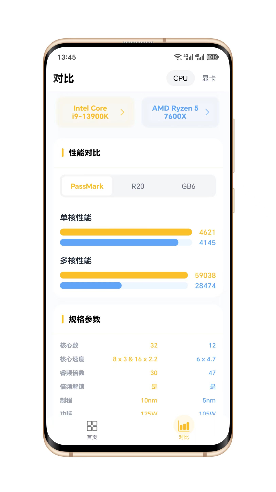
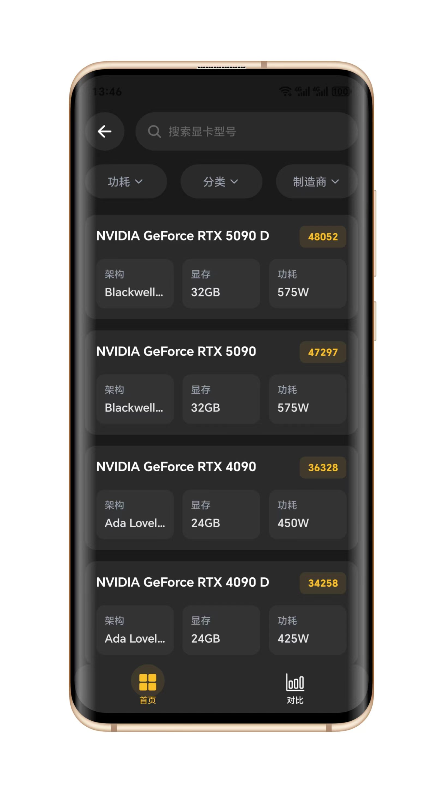
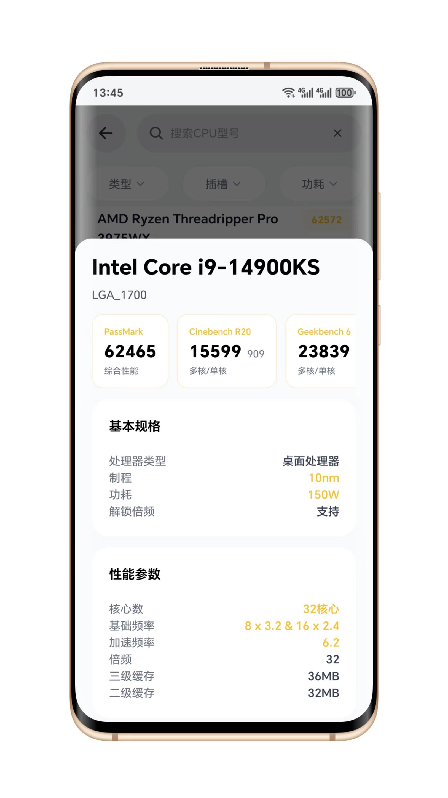

  
  <h1>极库 - GeekBase</h1>
  
简洁的硬件参数数据库

## 简介

GeekBase 是一款基于 React Native 开发的跨平台应用，专注于电脑硬件性能对比。为用户提供 CPU 和 GPU 的详细性能数据与参数对比，支持多项跑分数据，通过直观的图表展示硬件性能差异。应用采用简洁的设计，支持快速搜索、实时切换、暗黑模式等功能。

## 技术特点

- 基于 React Native 开发
- 支持 iOS 和 Android 双平台
- 离线应用
- 支持暗黑模式

## 截图展示

  
  
  
  

## 下载地址

- [下载APK安装包](https://github.com/c-zeong/geekbase/releases/download/1.0.0/geekbase.apk)
